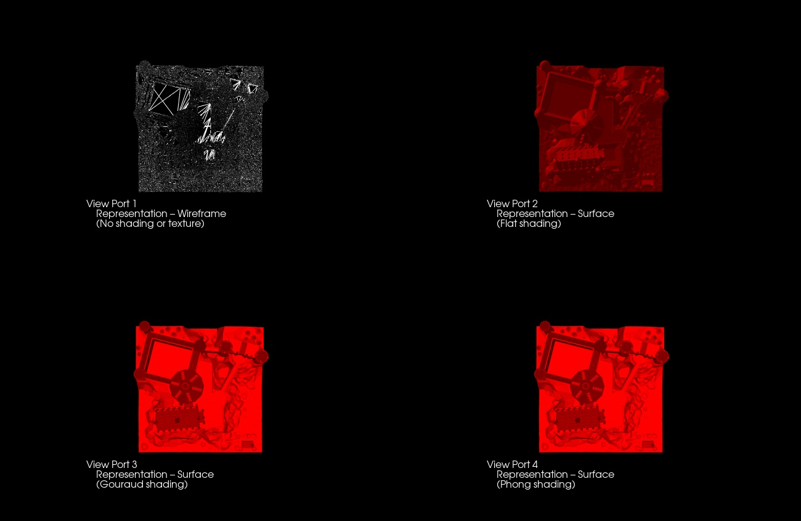

# MM - 804 Assignment 1

## Requirements
vtk==9.1.0
python==3.8.8

## Image description
Name - hogwarts.stl
File size - 24364 kb
Number of vertices - 749709

## Description
We created four view ports and render the 3D object with the shading and representations as below:

1) View Port 1 - Representation – Wireframe (No shading or texture)
2) View Port 2 - Representation – Surface (Flat shading)
3) View Port 3 - Representation – Surface (Gouraud shading)
4) View Port 4 - Representation – Surface (Phong shading)

Then we will Export the rendered 3D object to JPEG image to store the object

## Steps to follow to execute
Download the required packages in your local system with the given command.

pip install -r requirements.txt

Then run python file using command:

python renderer.py

# Output
Once the above steps are executed the output obtained is as follows:

